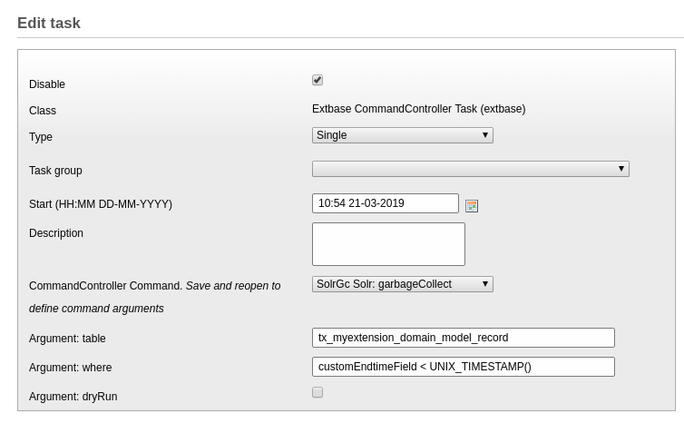

# TYPO3 Extension solr_gc

Provides a simple Extbase Command Controller that removes all records of a given `table` and matching a given `where` clause.

## Example: cli

```
typo3/cli_dispatch.phpsh extbase solr:garbagecollect --table tx_myextension_domain_model_record
```

## Example: scheduler task


